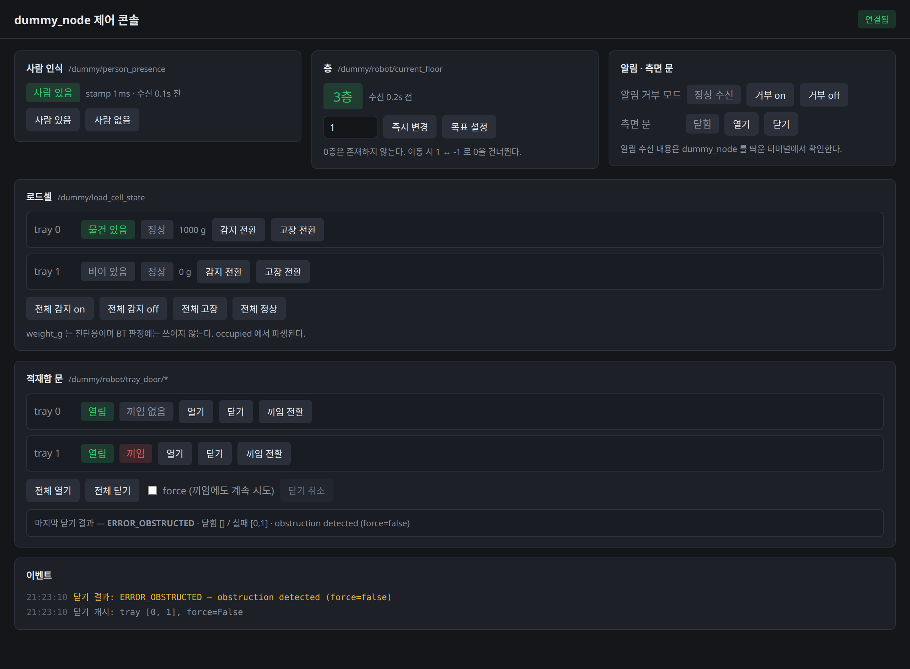

# dummy_node

ROS2 Jazzy 기반 **더미 / 테스트 하네스 노드** 모음 패키지.

실제 비즈니스 로직 없이, 외부 도구·테스트가 다양한 방식으로 상호작용할 수 있는
**테스트 대상(test target/fixture)** 노드들을 제공합니다.



브라우저에서 모든 더미 상태를 보면서 클릭으로 제어합니다
(자세한 내용은 [웹 제어 콘솔](#웹-제어-콘솔) 참고).

## 목적

외부에서 이 노드들을 상대로 다양한 ROS2 상호작용을 시험할 수 있게 한다.

**현재 지원**

- Topic publish / subscribe (다양한 메시지 타입, QoS)
- Service 요청 / 응답
- Action goal / feedback / result / cancel
- Parameter **읽기 전용** — 기동 시 config YAML로 초기값 주입 (아래 [파라미터](#파라미터-config) 참고)
- **웹 제어 콘솔** — 브라우저에서 모든 더미 상태를 보면서 클릭으로 제어 (아래 [웹 제어 콘솔](#웹-제어-콘솔) 참고)

**미지원**

- **동적 파라미터 (파라미터 쓰기)** — 각 인터페이스는 `setup()` 에서 값을 1회만 읽으므로
  `ros2 param set` 은 반영되지 않는다. 런타임 상태 변경은 서비스로 한다.
- TF 프레임 발행
- Lifecycle 상태 전이
- 의도적 지연 / 에러 / 타임아웃 주입 (장애 시뮬레이션)

미지원 항목은 필요해지는 시점에 인터페이스를 추가해 지원한다.

## 환경

- ROS2 Jazzy
- 패키지 2개: `dummy_node`(ament_python, 노드), `dummy_node_interfaces`(ament_cmake, 커스텀 srv/msg)

## 새 머신에 설치하기

아래 절차는 깨끗한 `ros:jazzy-ros-base` 환경에서 clone 부터 기동까지 실제로 수행해
확인한 것이다.

### 사전 조건

- **Ubuntu 24.04 (Noble) + ROS2 Jazzy.** 이 패키지는 Jazzy 기준으로 만들었다.
- ROS2 가 설치되어 있지 않다면 [공식 설치 문서](https://docs.ros.org/en/jazzy/Installation/Ubuntu-Install-Debs.html)를
  따라 `ros-jazzy-ros-base` 이상을 먼저 설치한다.

### 1. 빌드 도구 설치

```bash
sudo apt update
sudo apt install -y git python3-colcon-common-extensions python3-rosdep curl
```

### 2. 워크스페이스에 clone

저장소 루트가 **패키지 두 개를 담은 멀티패키지 루트**다. 따라서 워크스페이스의
`src/` **안으로** clone 해야 하며, `src/` 자체를 저장소로 만들면 안 된다.

```bash
mkdir -p ~/ros2_ws/src
cd ~/ros2_ws/src
git clone https://github.com/wntdev99/dummy_node.git
```

결과 구조는 다음과 같아야 한다.

```
~/ros2_ws/src/dummy_node/          # git repo 루트
├── dummy_node/                    # ament_python 패키지
└── dummy_node_interfaces/         # ament_cmake 패키지
```

### 3. 의존성 설치

개별 패키지를 손으로 설치하지 말고 `rosdep` 에 맡긴다. `package.xml` 선언을 따라가므로
나중에 의존성이 늘어도 이 명령 그대로 쓸 수 있다.

```bash
sudo rosdep init   # 이미 되어 있으면 오류가 나는데 무시해도 된다
rosdep update
cd ~/ros2_ws
rosdep install --from-paths src --ignore-src -y
```

현재 실제로 설치되는 것은 `ros-jazzy-example-interfaces` 하나다.

### 4. 빌드

```bash
cd ~/ros2_ws
source /opt/ros/jazzy/setup.bash
colcon build --packages-select dummy_node_interfaces dummy_node
```

> `dummy_node_interfaces` 를 **먼저** 빌드해야 한다. `--packages-select` 로 둘 다
> 지정하면 colcon 이 의존 순서를 알아서 맞춘다.

### 5. 통신 환경 맞추기 (가장 자주 놓치는 부분)

빌드가 되어도 **BT 와 도메인·RMW 가 다르면 서로를 아예 발견하지 못한다.** 오류가 나지
않고 조용히 통신만 되지 않으므로 원인을 찾기 어렵다. BT 가 도는 환경과 **같은 값**을 쓴다.

```bash
# ~/.bashrc 에 추가
source /opt/ros/jazzy/setup.bash
source ~/ros2_ws/install/setup.bash

export ROS_DOMAIN_ID=12                          # BT 쪽과 같은 값으로 맞춘다
export RMW_IMPLEMENTATION=rmw_cyclonedds_cpp     # BT 쪽과 같은 구현으로 맞춘다
```

`rmw_cyclonedds_cpp` 를 쓰려면 해당 패키지가 필요하다. 이는 `package.xml` 에 선언된
의존성이 아니므로 `rosdep` 이 설치해 주지 않는다.

```bash
sudo apt install -y ros-jazzy-rmw-cyclonedds-cpp
```

> 두 값은 환경마다 다르다. 이 저장소를 개발한 머신은 `ROS_DOMAIN_ID=12` 를 쓰지만,
> 시뮬레이터 컨테이너는 `10` 을 쓴다. **붙일 대상이 무엇인지 먼저 확인하고 맞춘다.**
> 서로 발견하는지는 `ros2 node list` 로 상대 노드가 보이는지로 판단한다.

### 6. 기동 및 확인

```bash
ros2 launch dummy_node dummy_node.launch.py
```

다음 세 가지가 모두 확인되면 정상이다.

```bash
# 노드 두 개가 떠 있는가
ros2 node list | grep dummy        # /dummy/dummy_node, /dummy/dummy_web

# 상태 토픽이 흐르는가
ros2 topic echo /dummy/person_presence --once

# 웹 콘솔이 응답하는가
curl -s http://localhost:8080/api/state | head -c 200
```

브라우저에서 `http://localhost:8080`, 다른 기기에서는 `http://<그 머신의 IP>:8080` 으로
접속한다. 웹 콘솔이 필요 없으면 `enable_web:=false` 로 끈다.

### 문제가 생겼을 때

| 증상 | 원인과 조치 |
|---|---|
| `Package 'dummy_node' not found` | `source ~/ros2_ws/install/setup.bash` 를 하지 않았다 |
| `ModuleNotFoundError: example_interfaces` | 3단계 `rosdep install` 을 건너뛰었다 |
| 노드는 뜨는데 BT 가 못 찾는다 | 5단계 `ROS_DOMAIN_ID` · `RMW_IMPLEMENTATION` 불일치다 |
| 웹 콘솔에 "발행 끊김" 표시 | `dummy_node` 프로세스가 죽었다. 런치 로그를 확인한다 |
| 다른 기기에서 접속되지 않는다 | 방화벽에서 8080 포트를 연다: `sudo ufw allow 8080/tcp` |
| 포트 8080 이 이미 쓰인다 | config 의 `web_port` 를 바꾼다 |

## 구조

```
dummy_node/                        # git repo 루트 (멀티패키지)
├── dummy_node/                    # ament_python 패키지 (노드 본체)
│   ├── dummy_node/
│   │   ├── node.py                # 코어 노드. interfaces/ 를 스캔해 자동 로드 (수정 불필요)
│   │   ├── registry.py            # InterfaceBase + @register 데코레이터 + 자동 탐색
│   │   ├── interfaces/            # 인터페이스 구현 (여기에 파일만 추가하면 확장 완료)
│   │       ├── demo_string_publisher.py     # Topic Publisher 예시
│   │       ├── demo_string_subscriber.py    # Topic Subscriber 예시
│   │       ├── demo_add_two_ints_service.py # Service Server 예시
│   │       ├── demo_fibonacci_action.py     # Action Server 예시
│   │       ├── robot_side_door.py           # SetBool 서비스 + Bool status 퍼블리셔
│   │       ├── robot_floor.py               # 층 이동 (SetInt 서비스 2종 + Int32 퍼블리셔)
│   │       ├── person_presence.py           # 사람 인식 (PersonPresence 퍼블 + SetBool 토글)
│   │       ├── load_cell.py                 # 로드셀 (LoadCellState 퍼블 + occupied/healthy 토글)
│   │       ├── tray_door.py                 # 적재함 문 (열기 srv + 닫기 action + 상태 토픽)
│   │       └── notify.py                    # 알림 서버 (수신 내용을 터미널에 출력)
│   │   └── web/                   # 웹 제어 콘솔 (별도 노드 `dummy_web`)
│   │       ├── console_node.py    # ROS 노드. 상태 구독 + 서비스/액션 클라이언트
│   │       ├── bridge.py          # 스레드 안전한 상태 스냅샷 보관소
│   │       ├── http_server.py     # 표준 라이브러리 HTTP 서버 (REST + SSE)
│   │       └── static/            # 화면 (index.html / app.js / style.css)
│   ├── config/
│   │   └── dummy_node.yaml        # 파라미터 기본값 (모든 파라미터는 여기서 관리)
│   └── launch/
│       └── dummy_node.launch.py   # config_file 인자로 YAML 경로 지정
└── dummy_node_interfaces/         # ament_cmake 패키지 (커스텀 인터페이스)
    ├── srv/SetInt.srv             # 정수 값 설정용 범용 서비스
    ├── srv/SetTrayBool.srv        # 더미 제어용 tray 단위 bool 설정
    ├── srv/OpenTrayDoor.srv       # 적재함 문 열기(개시)
    ├── srv/Notify.srv             # 알림 요청 (channel/level/code/mission_id/params)
    ├── action/CloseTrayDoor.action# 적재함 문 닫기(취소·끼임 지원)
    ├── msg/PersonPresence.msg     # 사람 인식 결과 (Header + is_person)
    ├── msg/LoadCellState.msg      # 로드셀 상태 (Header + LoadCellTray[])
    ├── msg/LoadCellTray.msg       # tray 1단 로드셀 (weight_g/occupied/healthy)
    ├── msg/TrayDoorState.msg      # 문 상태 (Header + TrayDoor[])
    └── msg/TrayDoor.msg           # 문 1개 (open/closed/obstructed)
```

### 새 인터페이스 추가법

1. `interfaces/` 안에 새 `.py` 파일 생성.
2. `InterfaceBase`를 상속한 클래스에 `@register` 데코레이터를 붙인다.
3. `setup()` 안에서 원하는 ROS 엔티티(publisher/subscriber/service/action)를 생성.
4. 파라미터가 필요하면 `setup()` 에서 `declare_parameter()` 로 선언하고,
   기본값 항목을 `config/dummy_node.yaml` 에 추가한다.

코어 노드는 기동 시 `interfaces/` 폴더를 자동 스캔하므로 `node.py`는 절대 손대지 않는다.
런치 파일도 파라미터 파일 경로만 넘기므로 파라미터가 늘어도 수정하지 않는다.

> **네임스페이스 규칙:** 모든 topic/service/action 이름은 `dummy/` 하위에 있어야 한다.
> 코어 노드가 `namespace="dummy"`로 생성되므로, 인터페이스는 **상대 이름**(예: `"my_topic"`)만
> 쓰면 자동으로 `/dummy/my_topic`이 된다. `~/`나 절대경로(`/...`)는 규칙을 깨므로 쓰지 않는다.

```python
from example_interfaces.msg import String
from dummy_node.registry import InterfaceBase, register

@register
class MyPublisher(InterfaceBase):
    name = "my_publisher"

    def setup(self):
        # 상대 이름 → /dummy/my_topic
        self._pub = self.node.create_publisher(String, "my_topic", 10)
        self.node.create_timer(1.0, self._tick)

    def _tick(self):
        self._pub.publish(String(data="hi"))
```

## 파라미터 (config)

모든 파라미터는 **`config/dummy_node.yaml`** 한 곳에서 관리한다. 인터페이스가 파라미터를
추가할 때 이 파일에만 항목을 넣으면 되고, **런치 파일은 수정하지 않는다.**

| 파라미터 | 타입 | 기본값 | 소유 인터페이스 | 의미 |
|---|---|---|---|---|
| `initial_floor` | int | `1` | `robot_floor` | 시작 층 (0층 부재, 지하 1층=-1) |
| `initial_is_person` | bool | `false` | `person_presence` | 시작 시 사람 인식 값 |
| `person_presence_period_sec` | double | `0.1` | `person_presence` | 사람 인식 발행 주기(초) |
| `tray_count` | int | `2` | **공유** (`load_cell` · `tray_door`) | 적재함 단 개수 (0=상단) |
| `load_cell_period_sec` | double | `0.1` | `load_cell` | 로드셀 상태 발행 주기(초) |
| `initial_load_cell_occupied` | bool | `false` | `load_cell` | 시작 시 물건 감지 여부 |
| `initial_load_cell_healthy` | bool | `true` | `load_cell` | 시작 시 로드셀 정상 여부 |
| `occupied_weight_g` | double | `1000.0` | `load_cell` | `occupied` 일 때 보고할 무게(g). 진단용 |
| `initial_doors_open` | bool | `false` | `tray_door` | 시작 시 문 열림 여부 |
| `tray_door_state_period_sec` | double | `0.2` | `tray_door` | 문 상태 발행 주기(초) |
| `door_open_duration_sec` | double | `2.0` | `tray_door` | 열기 개시 → 완전 열림 소요 시간 |
| `door_close_duration_sec` | double | `2.0` | `tray_door` | 닫기 개시 → 완전 닫힘 소요 시간 |
| `door_close_timeout_sec` | double | `10.0` | `tray_door` | `CloseTrayDoor` 1회 goal 제한 시간 |
| `notify_fail` | bool | `false` | `notify` | 기동 시부터 알림 요청을 거부할지 |

웹 제어 콘솔은 **별도 노드**이므로 YAML 키가 다르다(`/dummy/dummy_web`).

| 파라미터 | 타입 | 기본값 | 의미 |
|---|---|---|---|
| `web_host` | string | `0.0.0.0` | 접속 개방 범위. `127.0.0.1` 이면 이 PC 전용 |
| `web_port` | int | `8080` | HTTP 포트 |
| `service_timeout_sec` | double | `5.0` | 서비스 응답 대기 한도(초) |
| `tray_count` | int | `2` | 토픽 수신 전 화면에 그릴 tray 칸 수 (수신 후 자동 교정) |

> **YAML 키는 FQN(`/dummy/dummy_node`)이어야 한다.** 코어 노드가 코드에서
> `namespace="dummy"` 로 생성되므로 완전한 노드 이름이 `/dummy/dummy_node` 다.
> `dummy_node:` 만 쓰면 **적용되지 않고 조용히 무시된다**(실측 확인).

> **둘 이상의 인터페이스가 같은 파라미터를 쓸 때는 `InterfaceBase.param()` 을 쓴다.**
> 모든 인터페이스가 하나의 노드를 공유하므로 `declare_parameter` 를 두 번 호출하면
> `ParameterAlreadyDeclaredException` 이 나고, 로드가 개별 try/except 로 감싸여 있어
> **해당 인터페이스만 조용히 빠진다.** `param()` 은 이미 선언돼 있으면 기존 값을 읽으므로
> 로드 순서에 무관하다 (`tray_count` 가 그 예다).

> **동적 파라미터는 미지원이다.** 각 인터페이스는 `setup()` 에서 값을 1회만 읽으므로
> `ros2 param set` 은 반영되지 않는다. 런타임 상태 변경은 파라미터가 아니라
> 서비스(`/dummy/robot/set_current_floor`, `/dummy/person_presence/set` 등)로 한다.

## 빌드 & 실행

이미 워크스페이스가 준비된 상태에서 다시 빌드하고 실행할 때 쓴다.
처음 설치하는 머신이라면 [새 머신에 설치하기](#새-머신에-설치하기)를 먼저 본다.

```bash
cd ~/ros2_ws
colcon build --packages-select dummy_node_interfaces dummy_node
source install/setup.bash

# 직접 실행
ros2 run dummy_node dummy_node

# 런치 파일로 실행 (권장). 파라미터는 config/dummy_node.yaml 에서 읽는다.
ros2 launch dummy_node dummy_node.launch.py

# 다른 config 파일로 실행
ros2 launch dummy_node dummy_node.launch.py config_file:=/path/to/my_dummy.yaml

# 웹 제어 콘솔 없이 실행
ros2 launch dummy_node dummy_node.launch.py enable_web:=false
```

기본 제공 인터페이스 (모두 `dummy/` 네임스페이스 하위):

| 종류 | 이름 | 타입 |
|------|------|------|
| Publisher | `/dummy/chatter` | `example_interfaces/msg/String` (1Hz) |
| Subscriber | `/dummy/echo_in` | `example_interfaces/msg/String` |
| Service | `/dummy/add_two_ints` | `example_interfaces/srv/AddTwoInts` |
| Action | `/dummy/fibonacci` | `example_interfaces/action/Fibonacci` |
| Service | `/dummy/robot/open_side_door` | `example_interfaces/srv/SetBool` (문 열기/닫기) |
| Publisher | `/dummy/robot/side_door/status` | `example_interfaces/msg/Bool` (문 상태) |
| Service | `/dummy/robot/set_current_floor` | `dummy_node_interfaces/srv/SetInt` (즉시 층 변경) |
| Service | `/dummy/robot/set_target_floor` | `dummy_node_interfaces/srv/SetInt` (1층/초 이동) |
| Publisher | `/dummy/robot/current_floor` | `example_interfaces/msg/Int32` (현재 층, 1Hz) |
| Publisher | `/dummy/person_presence` | `dummy_node_interfaces/msg/PersonPresence` (사람 인식, 기본 10Hz, volatile) |
| Service | `/dummy/person_presence/set` | `example_interfaces/srv/SetBool` (`is_person` 토글) |
| Publisher | `/dummy/load_cell_state` | `dummy_node_interfaces/msg/LoadCellState` (기본 10Hz, volatile) |
| Service | `/dummy/load_cell/set_occupied` | `dummy_node_interfaces/srv/SetTrayBool` (물건 감지 토글) |
| Service | `/dummy/load_cell/set_healthy` | `dummy_node_interfaces/srv/SetTrayBool` (로드셀 정상여부 토글) |
| Publisher | `/dummy/robot/tray_door/state` | `dummy_node_interfaces/msg/TrayDoorState` (기본 5Hz, transient_local) |
| Service | `/dummy/robot/tray_door/open` | `dummy_node_interfaces/srv/OpenTrayDoor` (열기 개시) |
| **Action** | `/dummy/robot/tray_door/close` | `dummy_node_interfaces/action/CloseTrayDoor` (닫기, 취소 가능) |
| Service | `/dummy/robot/tray_door/set_obstructed` | `dummy_node_interfaces/srv/SetTrayBool` (끼임 감지 주입) |
| Service | `/dummy/notify` | `dummy_node_interfaces/srv/Notify` (알림 수신 → 터미널 출력) |
| Service | `/dummy/notify/set_fail` | `example_interfaces/srv/SetBool` (알림 거부 모드 토글) |

### 층(floor) 규칙

- 지하 1층 = `-1`, **0층은 존재하지 않음** (이동 시 `1 ↔ -1`로 0을 건너뜀).
- 초기 층은 파라미터 `initial_floor`(config)로 설정, 기본값 `1`.

```bash
# 단일 값만 임시로 바꾸는 경우
ros2 run dummy_node dummy_node --ros-args -p initial_floor:=3
```

### 사람 인식(person_presence)

`docs/spec/tasks/WaitNewTask.md` §3.6 규격의 스텁이다. 실제 인식 노드가 없는 단계에서
BT의 사람인식 조건 노드를 시험하는 데 쓴다.

- 토픽 `/dummy/person_presence` — `Header header` + `bool is_person`.
  QoS는 **reliable · depth 1 · volatile**(스펙 지정). latch가 아니므로 과거의
  `is_person=true` 가 재구독 시 되살아나지 않는다.
- `header.stamp` 는 발행 시점 시계로 매번 갱신한다. BT는
  `now - header.stamp > person_stale_ms` 면 사람 없음으로 간주한다.
- 값은 서비스로 토글한다.

```bash
# 사람 있음으로 전환
ros2 service call /dummy/person_presence/set example_interfaces/srv/SetBool "{data: true}"
# 사람 없음으로 전환
ros2 service call /dummy/person_presence/set example_interfaces/srv/SetBool "{data: false}"

# 발행 확인
ros2 topic echo /dummy/person_presence
```

파라미터: `initial_is_person`(기본 `false`), `person_presence_period_sec`(기본 `0.1`).
발행 주기는 실기 인식 노드 주기가 정해지면 그에 맞춰 조정한다(스펙 T1과 연동).

### 로드셀(load_cell)

`docs/spec/tasks/TakeParcelScreen.md` §3.2 규격의 스텁이다.

- 토픽 `/dummy/load_cell_state` — `Header` + `LoadCellTray[]`(`tray`/`weight_g`/`occupied`/`healthy`).
  QoS 는 **reliable · depth 1 · volatile**(스펙 지정).
- `weight_g` 는 **진단용**이며 BT 판정에는 쓰이지 않는다(스펙). 따라서 별도 설정 수단 없이
  `occupied` 로부터 파생시킨다(`occupied` → `occupied_weight_g`, 아니면 `0.0`).
  값이 두 곳에서 관리되어 서로 어긋나는 상태를 만들지 않기 위함이다.
- `healthy=false` 는 "로드셀로 확인 불가" 를 뜻하며 실패가 아니다 — BT는 사용자 확인 경로로 우회한다.

```bash
# tray 0 만 물건 감지
ros2 service call /dummy/load_cell/set_occupied dummy_node_interfaces/srv/SetTrayBool "{trays: [0], value: true}"
# 전 tray 로드셀 고장 시뮬레이션 (빈 배열 = 전체)
ros2 service call /dummy/load_cell/set_healthy dummy_node_interfaces/srv/SetTrayBool "{trays: [], value: false}"
```

### 적재함 문(tray_door)

`docs/spec/tasks/TakeParcelScreen.md` §3.3 규격의 스텁이다. **열기 = Service, 닫기 = Action,
상태 = Topic** 이라는 형태 배분이 스펙에서 확정된 것이며, 기존 `robot_side_door`(단일 문)는
tray 개념이 없어 이 스펙을 만족하지 못한다. BT는 이 인터페이스만 쓴다.

문 동작 모형: `closed → opening → open → closing → closed`.
`opening`/`closing` 중에는 `open` 과 `closed` 가 **둘 다 false**(= 이동 중)다.

| 상황 | 결과 |
|---|---|
| 정상 닫기 | `success=true`, `error=ERROR_NONE(0)` |
| 끼임 감지 + `force=false` | 중단 후 **열림 방향 복귀**, `error=ERROR_OBSTRUCTED(1)` |
| 끼임 지속 + `force=true` | 진행되지 않아 `door_close_timeout_sec` 에 걸림, `error=ERROR_TIMEOUT(2)` |
| 진행 중 goal 취소 | **열림 방향 복귀**, status `CANCELED`, `error=ERROR_ABORTED(3)` |
| 범위 밖 tray | goal 즉시 abort, `error=ERROR_ABORTED(3)` |

> **취소·끼임 시 열림으로 복귀시키는 이유**: 중간에서 멈춘 문을 "완전 열림" 으로 단정하지 않기
> 위해 실제로 열림 동작을 수행한다. 이동 중 상태(`open=false, closed=false`)로 방치하면
> 문 상태가 영구히 "불명" 이 되어 BT의 판정(§3.3.4)이 성립하지 않는다.

```bash
# 열기 (빈 배열 = 전체 tray). success 는 수락 여부이며 열렸다는 뜻이 아니다
ros2 service call /dummy/robot/tray_door/open dummy_node_interfaces/srv/OpenTrayDoor "{trays: []}"

# 닫기 (완료까지 feedback 수신)
ros2 action send_goal /dummy/robot/tray_door/close \
    dummy_node_interfaces/action/CloseTrayDoor "{trays: [], force: false}" -f

# 끼임 주입 → 닫기 시 ERROR_OBSTRUCTED 확인
ros2 service call /dummy/robot/tray_door/set_obstructed dummy_node_interfaces/srv/SetTrayBool "{trays: [1], value: true}"

# 상태 확인
ros2 topic echo /dummy/robot/tray_door/state
```

### 알림 서버(notify)

알림 요청을 받아 **수신 경로와 요청 전문을 터미널에 출력**한다. 실제 알림 수단이 준비되기
전까지, 알림이 실제로 도달했는지와 무엇이 실렸는지를 사람이 눈으로 확인하는 용도다.

스펙 대응: `TakeParcelScreen.md` §4.5 — `운영자에게 보고`(§10 D8, 상행 코드 신설 대기) ·
`사용자에게 알림`. **문구는 받지 않는다** — 문구 소유자는 수신 측이고 BT는 사유 코드만
넘긴다(§1.2). 그래서 `Notify.srv` 에는 `message` 입력이 없고 `code` 만 있다.

| 필드 | 의미 |
|---|---|
| `channel` | 수신 대상. `operator` \| `user` (그 외 값도 받되 경고를 남긴다) |
| `level` | 심각도. `info` \| `warn` \| `error`. 빈 값은 `info`. 로그 심각도에 반영된다 |
| `code` | 사유 코드 (예: `remaining_parcel`). 문구가 아니다 |
| `mission_id` | 대상 미션 id. 없으면 빈 문자열 |
| `params_json` | 부가 정보 JSON |
| 응답 `seq` | 서버가 부여한 수신 순번(1부터). 터미널 출력의 `#n` 과 대조한다 |

```bash
ros2 service call /dummy/notify dummy_node_interfaces/srv/Notify \
  '{channel: "operator", level: "warn", code: "remaining_parcel",
    mission_id: "m-001", params_json: "{\"tray\":0}"}'
```

출력 형태:

```
[notify] ── 수신 ────────────────────────────────────────────
  경로     : /dummy/notify
  channel  : operator
  level    : warn
  code     : remaining_parcel
  mission  : m-001
  params   : {"tray":0}
  수신시각 : 18:49:50.915  (#1)
──────────────────────────────────────────────────────────
```

**거부 모드** — 보고 실패 누적 경로(BT의 `report_fail_streak` → 한도 초과 이탈)를
시험하기 위한 것이다. 켜면 수신 내용은 그대로 출력하되 `success=false` 를 돌려준다.

```bash
ros2 service call /dummy/notify/set_fail example_interfaces/srv/SetBool "{data: true}"
```

## 웹 제어 콘솔

`ros2 service call` 을 손으로 입력하지 않고, **브라우저 화면 하나에서 모든 더미 상태를
보면서 클릭으로 제어**한다. ROS 명령을 몰라도 BT 시나리오를 재현할 수 있다.


위 화면은 실제로 시험 중인 상태다 — 사람 인식이 켜져 있고, tray 0 에 물건이 있으며,
문 두 짝이 열려 있고 tray 1 에 끼임이 주입되어 직전 닫기가 `ERROR_OBSTRUCTED` 로
끝난 이력이 이벤트에 남아 있다.

```bash
ros2 launch dummy_node dummy_node.launch.py
# 브라우저에서 http://localhost:8080 접속
# 같은 망의 다른 기기에서는 http://<이 PC의 IP>:8080
```

기본값이 `0.0.0.0` 이라 같은 망의 다른 기기에서도 접속된다. **인증이 없으므로 신뢰된
개발망에서만 쓴다.** 이 PC 전용으로 두려면 config 의 `web_host` 를 `127.0.0.1` 로 바꾼다.

웹 없이 기존 동작만 필요하면 `enable_web:=false` 로 끈다.

### 설계

```
[브라우저] ──HTTP + SSE──▶ [dummy_web 노드] ──ROS srv/action/topic──▶ [dummy_node]
```

- **더미의 내부 상태를 직접 만지지 않는다.** 화면의 조작은 전부 위에 정리된 ROS
  서비스·액션 호출로 바뀐다. 그래서 BT 가 쓰는 경로와 **같은 경로**가 검증되고,
  기존 `interfaces/*.py` 는 한 파일도 수정하지 않았다.
- **화면은 자체 상태를 보관하지 않는다.** 표시값은 전부 수신한 토픽에서 나온다.
  따라서 터미널에서 `ros2 service call` 로 바꾼 값도 화면에 그대로 반영되며,
  웹과 터미널을 번갈아 써도 표시가 어긋나지 않는다.
- **별도 프로세스**다. 같은 노드가 자기 서비스를 호출하는 형태를 피하기 위함이며,
  덕분에 `dummy_node` 가 죽어도 웹은 살아남아 "발행 끊김" 을 화면에 표시하고,
  재기동하면 자동으로 복구된다.
- **외부 의존성이 없다.** Python 표준 라이브러리 `http.server` 만 쓰므로
  `rosbridge_suite` 나 `flask` 를 설치할 필요가 없다.

### 화면 구성

| 카드 | 표시 | 조작 |
|---|---|---|
| 사람 인식 | `is_person`, `header.stamp` 경과(ms), 마지막 수신 경과 | 있음/없음 |
| 층 | 현재 층 | 즉시 변경, 목표 설정 (0층은 입력 단계에서 차단) |
| 알림 · 측면 문 | 알림 거부 모드, 측면 문 상태 | 거부 모드 토글, 문 열기/닫기 |
| 로드셀 | tray별 `occupied` · `healthy` · `weight_g` | tray별 토글, 전체 일괄 |
| 적재함 문 | tray별 상태(열림/닫힘/열리는 중/닫히는 중), 끼임, 닫기 goal 진행·결과 | 열기, 닫기(force), 취소, 끼임 주입 |
| 이벤트 | 닫기 goal 개시·결과, 거부된 요청 | — |

`header.stamp` 경과를 표시하는 이유는, BT 의 staleness 판정
(`now - stamp > person_stale_ms`)을 화면에서 눈으로 확인하기 위함이다.

문 상태는 `open`·`closed` 두 bool 에서 파생시킨다. 둘 다 `false` 면 이동 중인데,
토픽만으로는 방향을 알 수 없으므로 마지막으로 지시한 명령으로 `열리는 중` 과
`닫히는 중` 을 구분한다. 끼임·취소로 열림 복귀가 일어나면 방향 표시도 함께 뒤집힌다.

### HTTP API

화면을 거치지 않고 스크립트로 조작할 수도 있다.

| 메서드 · 경로 | 동작 |
|---|---|
| `GET /api/state` | 현재 상태 스냅샷(JSON) 1회 |
| `GET /api/events` | 상태 변화를 흘려보내는 SSE 스트림 (최대 5Hz) |
| `POST /api/service/<key>` | 서비스 호출. `key` 는 서버가 가진 목록으로만 해석한다 |
| `POST /api/action/close` | 닫기 goal 전송 (`{"trays": [], "force": false}`) |
| `POST /api/action/close/cancel` | 진행 중인 닫기 goal 취소 |

```bash
# tray 0 만 물건 감지
curl -X POST http://localhost:8080/api/service/load_cell_occupied \
  -H "Content-Type: application/json" -d '{"trays":[0],"value":true}'

# 전체 닫기 (끼임에도 계속 시도)
curl -X POST http://localhost:8080/api/action/close \
  -H "Content-Type: application/json" -d '{"trays":[],"force":true}'
```

`key` 는 `person_set`, `load_cell_occupied`, `load_cell_healthy`, `tray_door_open`,
`tray_door_obstructed`, `floor_current`, `floor_target`, `side_door`, `notify_fail`
아홉 개다. **목록에 없는 이름은 거부한다** — 웹이 `0.0.0.0` 으로 열려 있으므로,
브라우저가 임의의 ROS 서비스를 호출할 수 있게 두지 않기 위함이다.

### 알려진 제약

- **알림 수신 내용은 웹에서 볼 수 없다.** `notify` 는 서비스 서버라 외부에서 관찰할
  방법이 없다. 거부 모드 토글만 제공하며, 수신 전문은 기존대로 `dummy_node` 를 띄운
  터미널에서 확인한다.
- **인증·HTTPS 가 없다.** 신뢰된 개발망 전용이다.
- 알림 거부 모드의 **초기 표시**는 기동 시 `dummy_node` 의 파라미터를 한 번 읽어
  맞춘다. 읽지 못하면 `알 수 없음` 으로 표시되며, 한 번 토글하면 정확해진다.
